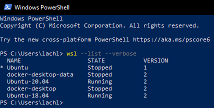

# Local ROS Setup

The Rover is built with ROS Melodic on Ubuntu-18.04 LTS. If you have an install of Ubuntu-18.04 as your boot OS or virtual machine please skip to Step 2.

## Windows Setup

ROS is strictly on linux, and to keep the rover from having strange dependancy issues we recommend using the same OS version for development as production, which in > this case is Ubuntu 18.04. Below are instructions on using WSL, other ways to install Ubuntu and ROS include setting up dual booting, using a liveusb or using a > virtual machine. I have found that Live USB is generally underperformant especially for use in simulations, Dual Booting works but you may run into issues if you do not have enough hard drive space and a virtual machine can sometimes run in to performance issues.

Although WSL is not the greatest solution available, it is natively supported by the Windows team and does not require a new install of Linux to run.

### Enable WSL2 on Windows

WSL2 requires the latest build of Windows 10 to be installed. If you dont have the correct requirements you may have to develop on the Rover itself or in a Virtual Machine / Dual boot system.

This below tutorial should stay up to date. 

https://docs.microsoft.com/en-us/windows/wsl/install-win10

As Above: 

- Enable the Windows Subsystem for Linux
- Check requirements for running WSL 2
- Enable Virtual Machine feature
- Download the Linux kernel update package
- Set WSL 2 as your default version
- install ubuntu 18.04 terminal https://www.microsoft.com/store/apps/9N9TNGVNDL3Q
- I recommend Installing Windows Terminal from the Microsoft Store as well.

You can check the install worked properly by opening powershell and entering
```
wsl --list --verbose
```
!!! info inline end
    Notice how Ubuntu 18.04 is version 2



#### Setup X server connection

Download [vcxsrv](https://sourceforge.net/projects/vcxsrv/files/latest/download) on Windows

Launch XLaunch via the Start Menu.

Launch with default params, except for `Additional Parameters->No Access Control`, which should be checked.

Install x11-apps on ubuntu 18.04
```
sudo apt install x11-apps
```

Copy and Paste these commands

```
echo 'export DISPLAY=$(cat /etc/resolv.conf | grep nameserver | awk '\''{print $2}'\''):0' >> ~/.bashrc
echo "export LIBGL_ALWAYS_INDIRECT=1" >> ~/.bashrc
source ~/.bashrc
echo "source ~/.bashrc" >> ~/.bash_profile
```

Run xeyes to test if your window opens correctly

```
xeyes
```

### Install ROS Melodic

Full tutorial [here](http://wiki.ros.org/melodic/Installation)

In your ubuntu 18.04 terminal copy and paste these commands.

```
sudo sh -c 'echo "deb http://packages.ros.org/ros/ubuntu $(lsb_release -sc) main" > /etc/apt/sources.list.d/ros-latest.list'
```
```
sudo apt install curl
```
```
curl -s https://raw.githubusercontent.com/ros/rosdistro/master/ros.asc | sudo apt-key add -
```
```
sudo apt update
```
```
sudo apt install ros-melodic-desktop-full
```

This will take a few minutes.


### Setting up environment

```
echo 'export ROS_VER=melodic' >> ~/.bashrc
echo 'source /opt/ros/$ROS_VER/setup.bash' >> ~/.bashrc
source ~/.bashrc
```

```
sudo apt-get install python-catkin-tools
```

Create a new directory for your ROS workspace and change to this directory in Ubuntu using `cd path/to/dir`. If you are using WSL `/mnt/c/Users/user_name/Documents/` will take you to the Documents directory, `c` refers to your hard drive, unlike in Windows this must be lowercase, while typing up the path you can double click `tab` to view the contents of the path.

```
mkdir -p catkin_ws/src
cd catkin_ws
catkin init
cd src
echo "export ROVER_WS=$(pwd)" >> ~/.bashrc
echo 'alias setup=$ROVER_WS/../devel/setup.bash' >> ~/.bashrc
```


